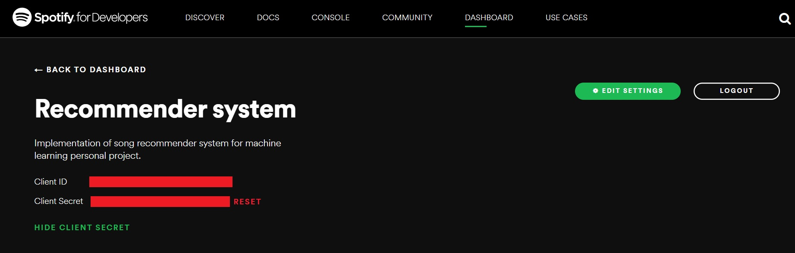

# Recommendify

[](https://codeclimate.com/github/mickuz/recommendify/maintainability)
[](https://codecov.io/gh/mickuz/recommendify)
[](https://travis-ci.com/mickuz/recommendify)

Recommendify is an open source implementation of a simple content-based song recommendation engine for Spotify. It uses the audio features of tracks located on user's playlists. Recommendify is built with the usage of Spotify API and Random Forest model included in *scikit-learn* package.

## Installation

To install Recommendify, run:
```
git clone https://github.com/mickuz/recommendify

cd recommendify

pip3 install -e .
```

## Usage

To get started, you need to visit developer.spotify.com and log into your Spotify account. Then go to your dashboard and create a new application. After it is done both client ID and client secret ID gets generated.



Copy these tokens and execute the following comamands:
```
export CLIENT_ID=your_client_id

export CLIENT_SECRET=your_client_secret
```
You can specify which playlists will be used for training and predictions by modifying corresponding fields in the `src/configs/config.yaml` file. Next you can pull the audio features of tracks by running:
```
fetch-data
```
To process the received data, run:
```
process-data
```
The training step is executed by the following command:
```
train
```
Finally you can get predictions performing:
```
predict
```

## Future improvements

- Refactor of the code to follow object-oriented programming paradigm to a further extent.
- Put more focus on feature engineering to improve performance of a model.
- Let user to choose playlists as an arguments of the commands.
- Let user to choose individual songs to predict.
- Deploy the model via a REST API with Flask.